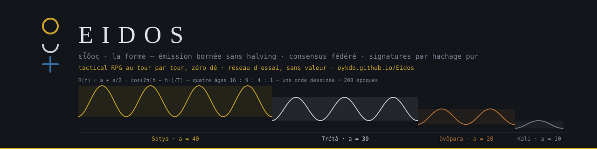

[](https://oykdo.github.io/Eidos/)

# Eidos

[English](README.md) · **Français**

[](https://github.com/Oykdo/Eidos/actions/workflows/tests.yml)
[](https://github.com/Oykdo/Eidos/actions/workflows/chaine.yml)
[](https://oykdo.github.io/Eidos/)

Chaîne prototype à **émission bornée sans halving**, **consensus fédéré**, et **signatures post-quantiques par hachage pur** — aucune courbe elliptique nulle part. La spécification est en Python, bibliothèque standard uniquement. Un atelier web rejoue les mêmes règles dans le navigateur. Réseau d'essai seulement : l'eidôlon n'a aucune valeur.

- Atelier en ligne : [oykdo.github.io/Eidos](https://oykdo.github.io/Eidos/)
- Réseau d'essai : sept validateurs, un bloc par heure forgé par GitHub Actions, robinet et envois par issues
- Un seul fichier pour votre coffre : `eidos.carnet`

## Sommaire

1. [L'unité et la forme](#1-lunité-et-la-forme)
2. [Les cinq propositions](#2-les-cinq-propositions)
3. [Émission](#3-émission)
4. [Glyphes](#4-glyphes)
5. [Signatures](#5-signatures)
6. [Consensus fédéré](#6-consensus-fédéré)
7. [Le réseau d'essai](#7-le-réseau-dessai)
8. [Reliques et sceaux d'âge](#8-reliques-et-sceaux-dâge)
9. [L'atelier](#9-latelier)
10. [Carte du dépôt](#10-carte-du-dépôt)
11. [Tout vérifier](#11-tout-vérifier)
12. [Ce que ce dépôt ne fait pas](#12-ce-que-ce-dépôt-ne-fait-pas)
13. [Licence](#13-licence)

## 1. L'unité et la forme

L'unité de compte est l'**eidôlon** — εἴδωλον, l'image — en regard d'*eidos*, εἶδος, la forme. La forme est la règle ; l'image est ce qui circule. 1 eidôlon = 10⁸ atomes.

## 2. Les cinq propositions

1. **La récompense ne se divise jamais.** Elle oscille selon un cosinus borné, et la somme d'une époque est exacte à l'atome près.
2. **La semaine n'est pas une convention.** 24 = 3 × 7 + 3 ; ce reste de trois engendre l'ordre des jours, et sert ici de rotation des proposants.
3. **Une adresse se lit.** Trois figures empilées, six bits par glyphe, somme de contrôle vérifiable à l'œil.
4. **L'énergie est bornée par le consensus, pas par la récompense.** Une preuve de travail ne borne jamais l'énergie ; une fédération, si.
5. **Rien ne se croit, tout se rejoue.** Le carnet UTXO n'est jamais écrit sur le disque : il est reconstruit par rejeu intégral à chaque ouverture, par le même code qu'à la forge.

## 3. Émission

```
R(h) = a + b·cos( 2π(h − h₀) / T )     avec b = a/2
```

La somme des cosinus sur une période complète est nulle : une époque émet **exactement** `a·T`, réparti à l'atome près par la méthode du plus fort reste.

| Paramètre | Valeur | Origine |
|---|---|---|
| Intervalle de bloc (spec) | 600 s | — |
| `T` — blocs par époque | **1008** | 168 heures × 6 blocs = une semaine |
| `h₀` — culmination | **492** | 41/84 de l'époque, entier exact |
| Bornes | `[a/2, 3a/2]` | rapport max/min = 3 |

### Les quatre âges

| Âge | `a` | Époques | Blocs | Émission | Mise du sceau (atelier) |
|---|---|---|---|---|---|
| Satya | 40 | 832 | 838 656 | 33 546 240 | 33,55 eidôla |
| Trétâ | 30 | 624 | 628 992 | 18 869 760 | 18,87 |
| Dvâpara | 20 | 416 | 419 328 | 8 386 560 | 8,39 |
| Kali | 10 | 208 | 209 664 | 2 096 640 | 2,10 |

**Émission totale : 62 899 200** eidôla sur 2 096 640 blocs, soit 2 080 semaines ≈ 39,9 ans. Rapport 16 : 9 : 4 : 1. Mise du sceau = émission de l'âge / 1 000 000.

`math.cos` dépend de la libm locale : deux nœuds peuvent diverger. Eidos calcule le cosinus en `decimal.Decimal` par série de Taylor, avec π à 68 décimales. Les tables sont figées dans `genesis.json`. **Toute modification de `eonis.py`, même d'un commentaire, invalide la genèse** — la CI vérifie son empreinte.

```
genesis.json  06b47645abedb5e0ac7d2fc7a1dd6fcd386ef493874fd2774544565ac46dbe28
eonis.py      cc94ad1e6eadf7027414a1347e870a4842689431b8fca2c1b381f93f4f1dfabc
bloc 0        00003d32ffa7a1dc7f1ace8ec08d0c739126ad4449fe004ea772710baec2c7b6
```

La bannière en tête est dessinée depuis cette formule par `docs/banniere.py`, avec le même cosinus Decimal.

## 4. Glyphes

Trois étages, quatre états : vide `00`, cercle `01`, croissant `10`, croix `11`. Un glyphe porte **6 bits**, lus de haut en bas.

| Usage | Bits | Glyphes |
|---|---|---|
| Adresse | 160 | 27 |
| Somme de contrôle | 24 | 4 |
| Empreinte pleine | 256 | 43 |

Les 2 bits de bourrage du 27ᵉ glyphe doivent être nuls, sinon l'adresse est refusée. **Interdit** : dériver une clé ou une graine de cet alphabet.

## 5. Signatures

Tout repose sur SHA-256, **sans aucune courbe elliptique**. La résistance quantique est structurelle, pas rapportée.

- **WOTS+ pour les dépenses** (`wots.py`, RFC 8391 : w = 16, 67 chaînes SHA-256, chaque maillon tweaké par la graine publique et une adresse de hachage, arbre L). Le vérificateur reconstruit la clé publique depuis la signature : témoin de **2 176 octets** (graine publique 32 + signature 2 144), contre 24 576 en Lamport. Adresse = SHA-256(graine publique ‖ racine L)[:20]. **Une clé ne signe qu'une fois** : une adresse ne peut être dépensée qu'une fois dans toute la chaîne, et les adresses dépensées sont notées même à travers une reprise assume-valid. Le portefeuille produit une adresse fraîche à chaque usage.
- **XMSS pour les validateurs.** 2^k clés WOTS+ sous un arbre de Merkle tweaké, clé publique = (racine, graine publique). Signature de bloc : 4 + 2 144 + 32·k octets. Schéma à état : restaurer une sauvegarde ancienne, c'est rejouer des indices déjà publiés. Le signataire tient donc un **compteur persistant** (`indice-<v>.json`, monotone, écrit sous verrou exclusif et relu depuis le disque avant chaque signature), et un nœud qui connaît déjà des indices publiés refuse de repartir de la chaîne seule sans ordre explicite.
- **Racine UTXO dans l'en-tête signé.** Chaque bloc déclare la racine de Merkle du carnet entier après lui (feuille = SHA-256d(txid ‖ rang ‖ adresse ‖ montant), ordre (txid, rang)) ; `id_bloc = SHA-256d(E.header ‖ racine)`. Un témoin qui ne tient que la tête signée (`etat.json.tete_signee`) recompose `id_bloc`, vérifie la signature XMSS et juge une preuve de sortie sans rejouer. `noeud.py --depuis <h> <racine>` reprend à un point de contrôle explicite, jamais implicite.
- **Sérialisation canonique.** Une transaction doit se retrouver à l'octet près après désérialisation, sinon elle est refusée.
- **Lamport** reste dans l'atelier en démonstration (réemploi, audit), hors consensus.

## 6. Consensus fédéré

`n` validateurs, un créneau par bloc. Proposant du créneau `s` : `V[(3·s) mod n]`. Avec `n = 7` : `[0, 3, 6, 2, 5, 1, 4]`. Un `n` divisible par trois est refusé.

**Finalité** : seuil `⌊2n/3⌋ + 1`, **indépendant du pas de rotation**. Sept validateurs → cinq signatures.

**Vivacité** : un créneau `s > créneau(now) + 1` est refusé ; sans cette borne, un seul bloc daté trop loin gèlerait la chaîne. Sauter un créneau (silence) reste permis, et les trous sont publiés (`creneaux_sautes`). Au plus six créneaux rattrapés par exécution.

**Rejeu** : `Σ utxo == émission cumulée` après chaque bloc ; le nœud refuse de publier si l'invariant est rompu. La coinbase vaut exactement `récompense(h) + frais`.

Deux consensus coexistent dans le dépôt : le **fédéré** (`federation.py` + `noeud.py`, le vrai) et un jouet **preuve de travail** historique (`consensus.py` + `store.py`). Ils ne se mélangent jamais.

## 7. Le réseau d'essai

| | |
|---|---|
| Validateurs | 7, graines dérivées du tag public `eidos-testnet-3` |
| Signatures | XMSS de hauteur 12 : 4 096 par validateur, environ trois ans de blocs horaires |
| Créneau | 3 600 s sur le réseau d'essai (`federation.json`), 600 s dans la spec |
| Forge | `chaine.yml`, cron horaire sur GitHub Actions, sur `main` seulement |
| Fichier de chaîne | `chaine-eidos.dat`, format 3, écrit par la CI et jamais à la main |
| État publié | `etat.json` : soldes, sorties, tête signée, reliques, invariant |

- **Robinet.** Ouvrez une issue contenant une adresse en glyphes ; `robinet.py` sert **un eidôlon par demande**, une demande servie par compte GitHub et par époque, une seule en attente, dans un budget d'époque de `a·T / 8`. Le corps de l'issue n'est jamais interpolé dans une commande : il transite par une variable d'environnement, et seul ce qui passe le filtre de figures et la somme de contrôle est retenu.
- **Envois.** L'atelier signe une dépense et produit un bloc de texte entre marqueurs `-----EIDOS-----` (base64, lignes de 76) ; collez-le dans une issue. Le nœud valide chaque envoi dans un bloc candidat sur une copie profonde du carnet, en inclut au plus 8 par bloc, porte leurs frais dans la coinbase, et fait expirer les demandes de plus d'une époque.

Ne jamais écrire `chaine-eidos.dat`, `etat.json` ni `mempool.json` depuis un poste : ces fichiers appartiennent aux workflows `chaine` et `robinet`.

## 8. Reliques et sceaux d'âge

Une **relique** est une pièce scellée sur une adresse WOTS+ dont la graine est imprimée dans un code QR caché quelque part dans le monde. La récupérer, c'est la dépenser vers son coffre (page Reliques → « Relique trouvée », puis une issue d'envoi). Une clé ne signant qu'une fois, la relique ne se récupère qu'**une fois, par construction** : pas de serveur, pas de registre, la chaîne fait foi. Le gardien scelle avec `python3 relique.py --sceller --age Kali --indice "…"` (QR en SVG, planche imprimable, entrée dans `reliques.json`), et la graine n'existe **que dans le QR**. Le nœud publie le statut de chaque relique déclarée dans `etat.json` (`attente` / `intacte` / `recuperee`) : une lecture, pas une preuve. `python3 relique.py --animer <txid>` dessine la relique en figures · ○ ☽ ✚ sur l'ellipse de son âge.

Une relique récupérée dans un coffre devient un **sceau d'âge**. La Tour est coupée en quatre quartiers (étages 0–63, 64–127, 128–191, 192–254) ; les portes 64, 128 et 192 ne s'ouvrent qu'au sceau du bon âge. La mise attendue d'un sceau est l'émission de son âge / 10⁶ — Kali 2,10 … Satya 33,55.

Détail : [`docs/HANDOVER_RELIQUES_QR.md`](docs/HANDOVER_RELIQUES_QR.md).

## 9. L'atelier

`atelier/` est l'interface web (TanStack Start, React, three.js), 18 dépendances d'exécution. Elle rejoue la spécification en TypeScript (`atelier/src/lib/eidos/`), et `vecteurs.json` — écrit par `vecteurs.py`, relu des deux côtés — garde Python et TypeScript identiques à l'octet (job CI `parite`).

| Registre | Page | Rôle |
|---|---|---|
| Vérifier | **Coffre** | Solde, envoyer, sauver `eidos.carnet` |
| | **Journal** | Genèse, chaîne, preuve Merkle |
| | **Témoin** | Seconde mémoire : la tête signée, pas les clés. Juge une sortie publiée |
| | **Glyphes** | 64 empilements, bourrage refusé |
| Lire | **Carte** | Reliques du monde par âge et par muse ; trophée d'un sceau, jugé sans rejeu |
| | **Signes** | Lectures des mêmes 64 glyphes |
| Jouer | **Tour** | 255 étages, neuf muses en hôtes, élixirs, capsules et bestiaire, secrets, portes par sceau |
| | **Reliques** | La scène de la relique et « Relique trouvée » |
| | **Guide** | Vérifier / Lire / Jouer, les cinq mots, les limites |

**La Tour et le pendule.** L'exploration est libre ; en fin de salle, le pendule lit ce que le coffre y a fait (honoré l'hôte, ouvert une alcôve, pris un occupant, ou rien) et choisit le **parcours** — 27 étapes sur neuf bandes — et la case d'arrivée, jamais le contenu d'un étage, qui reste public et fixe. Un run libre est une lecture et ne compte pour rien. Un run qui compte est **ancré** : sa graine est `SHA-256d("eidos-ascension/1" ‖ id_bloc ‖ txid ‖ rang)` — une tête signée et une pièce prouvée non dépensée, jamais le coffre, la machine ni le navigateur. L'ascension achevée s'exporte et se juge sans rejeu. Pas d'empreinte de navigateur, pas de verrou de machine, pas de preuve de travail côté client : ce qui compte est ancré, ce qui est libre ne vaut rien ([`docs/SPEC_SYBIL.md`](docs/SPEC_SYBIL.md)).

**Figures ≠ preuves.** La carte, les signes, la scène de la relique et les artefacts sont des lectures ; seuls le carnet, la chaîne et les signatures engagent.

**Un seul fichier.** Le coffre s'écrit dans `eidos.carnet`. WOTS+ signe une dépense, pas le fichier — signer une sauvegarde brûlerait une clé à usage unique ; le fichier porte une trace SHA-256d liée à l'adresse courante. Un ancien `.psnx` s'ouvre encore, puis se réécrit en `.carnet`.

Détail : [`atelier/README.md`](atelier/README.md).

## 10. Carte du dépôt

| Fichier | Lignes | Rôle | Contrôles |
|---|---|---|---|
| `eonis.py` | 267 | émission (cosinus Decimal), codec des glyphes — **gelé** | 6 |
| `genesis.json` | 105 | tables et empreintes figées — **gelé** | — |
| `verify_genesis.py` | 134 | vérification indépendante de la genèse | 32 |
| `wots.py` | 284 | WOTS+ w = 16, arbre L, adresses, empreintes | 5 |
| `utxo.py` | 509 | témoins, adresses, transactions, carnet, racine UTXO, validation | 15 |
| `federation.py` | 694 | XMSS, rotation, vivacité, tête signée, compteur persistant verrouillé | 18 |
| `noeud.py` | 1084 | nœud du testnet : rejeu, forge, robinet, envois, `--depuis`, reliques, `etat.json` | 5 + 4 + 5 + 2 |
| `robinet.py` | 356 | file du robinet alimentée par issues, frein par auteur | 11 |
| `vecteurs.py` | 171 | vecteurs partagés Python ↔ TS (`vecteurs.json`, 8 familles) | parité |
| `qr.py` | 428 | encodeur QR, bibliothèque standard, niveau H, versions 1–10 | 5 |
| `relique.py` | 236 | gardien des reliques : sceller, animer | 3 |
| `consensus.py` | 204 | difficulté PoW et travail cumulé — historique | 6 |
| `store.py` | 278 | chaîne PoW sur disque — historique | — |
| `federation.json` | — | racines et graines publiques des 7 validateurs, t0, créneau | — |
| `reliques.json` | — | reliques déclarées : id, adresse, âge, indice — jamais de graine | — |
| `chaine-eidos.dat` | — | la chaîne du testnet, écrite par la CI | — |
| `etat.json`, `mempool.json` | — | état publié ; demandes de robinet et d'envoi | — |
| `docs/` | — | spécifications : reliques, tour, pendule, Sybil, audit des coffres ; générateur des bannières | 2 |
| `atelier/` | — | atelier web ; `npm test` lance 30 tests de scripts et 286 tests Eidos | 286 |

CI (`.github/workflows/`) : `tests.yml` (3 OS × 2 Python, empreintes, hygiène, `parite`), `chaine.yml` (forge horaire), `robinet.yml` (issues), `pages.yml` (atelier), `init.yml`. Python 3.9 est le plancher.

## 11. Tout vérifier

```bash
python3 verify_genesis.py      # 32 contrôles — toujours en premier
python3 eonis.py               # 6
python3 wots.py                # 5
python3 utxo.py                # 15
python3 vecteurs.py            # parité Python ↔ TS
python3 robinet.py --test      # 11
python3 -c "import noeud as N; N._test_artefact()"
python3 -c "import noeud as N; N._test_envois()"      # 5
python3 -c "import noeud as N; N._test_depuis()"      # 4
python3 -c "import noeud as N; N._test_indice()"      # 2
python3 -c "import noeud as N; N._test_reliques()"    # 5
python3 qr.py --test           # 5
python3 relique.py --test      # 3
python3 federation.py          # 18
python3 consensus.py           # 6, historique
python3 noeud.py --verifier    # rejeu intégral du testnet : doit finir par « aucun refus »
python3 docs/banniere.py       # redessine les bannières, 2 contrôles
cd atelier && npm ci && npm test && npm run dev
```

Les tests sont des `assert` et des `print` nus, sans framework. Toute règle de validation vient avec un contrôle qui la viole.

## 12. Ce que ce dépôt ne fait pas

- **Pas de réseau.** Ni pairs, ni résolution de fork réelle : le réseau d'essai est un nœud sur un cron.
- **Pas de stockage de clés sécurisé.** La graine est en clair dans le fichier.
- **Pas d'audit externe.** WOTS+, XMSS et l'arbre de Merkle sont des implémentations maison, écrites d'après la RFC 8391 sans vecteurs officiels.
- **Une fédération n'est pas sans confiance.** `n` signataires connus peuvent s'entendre. La question ouverte est la gouvernance, pas la cryptographie.
- **Cadre réglementaire.** Prototyper est libre ; émettre et distribuer un jeton public relève de MiCA dans l'UE. L'eidôlon n'a aucune valeur.

## 13. Licence

[Apache License 2.0](LICENSE). Copyright 2026 Jeremy Zgonec.
