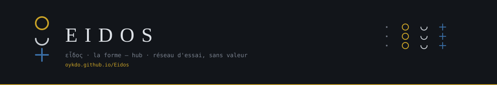

[](https://oykdo.github.io/Eidos/)

# Eidos

[Français](#français) · [English](#english)

**FR.** Chaîne à émission bornée sans halving, consensus fédéré, cryptographie post-quantique par hachage pur. Un fichier : `eidos.carnet`.

**EN.** Bounded-emission chain without halving. Federated consensus. Hash-only post-quantum signatures. One file: `eidos.carnet`.

Prototype Python, bibliothèque standard uniquement — no dependencies, no compiled extensions. Atelier web : [oykdo.github.io/Eidos](https://oykdo.github.io/Eidos/).

---

## Français

L'unité de compte est l'**eidôlon** — εἴδωλον, l'image — en regard d'*eidos*, εἶδος, la forme. La forme est la règle ; l'image est ce qui circule. 1 eidôlon = 10⁸ atomes.

### Les cinq propositions

1. **La récompense ne se divise jamais.** Elle oscille selon un cosinus borné, et la somme d'une époque est exacte à l'atome près.
2. **La semaine n'est pas une convention.** 24 = 3 × 7 + 3 ; ce reste de trois engendre l'ordre des jours, et sert ici de rotation des proposants.
3. **Une adresse se lit.** Trois figures empilées, six bits par glyphe, somme de contrôle vérifiable à l'œil.
4. **L'énergie est bornée par le consensus, pas par la récompense.** Une preuve de travail ne borne jamais l'énergie ; une fédération, si.
5. **Rien ne se croit, tout se rejoue.** Le carnet UTXO n'est jamais enregistré : il est reconstruit par rejeu intégral à chaque ouverture.

### Émission

```
R(h) = a + b·cos( 2π(h − h₀) / T )     avec b = a/2
```

La somme des cosinus sur une période complète est nulle. L'émission d'une époque vaut **exactement** `a·T`.

| Paramètre | Valeur | Origine |
|---|---|---|
| Intervalle de bloc | 600 s | — |
| `T` — blocs par époque | **1008** | 168 heures × 6 blocs = une semaine |
| `h₀` — culmination | **492** | 41 / 84 de l'époque, entier exact |
| Bornes | `[a/2, 3a/2]` | rapport max/min = 3 |

#### Les quatre âges

| Âge | `a` | Époques | Blocs | Émission | Relique (atelier) |
|---|---|---|---|---|---|
| Satya | 40 | 832 | 838 656 | 33 546 240 | 33,55 eidôla |
| Trétâ | 30 | 624 | 628 992 | 18 869 760 | 18,87 |
| Dvâpara | 20 | 416 | 419 328 | 8 386 560 | 8,39 |
| Kali | 10 | 208 | 209 664 | 2 096 640 | 2,10 |

**Émission totale : 62 899 200** sur 2 096 640 blocs, soit 2 080 semaines ≈ 39,9 ans. Rapport 16 : 9 : 4 : 1. Prix d'atelier = émission / 1 000 000.

`math.cos` dépend de la libm : deux nœuds peuvent diverger. Eidos calcule le cosinus en `decimal.Decimal` (π à 68 décimales). Les tables sont figées dans `genesis.json`. **Toute modification de `eonis.py`, même d'un commentaire, invalide la genèse.**

```
genesis.json  06b47645abedb5e0ac7d2fc7a1dd6fcd386ef493874fd2774544565ac46dbe28
eonis.py      cc94ad1e6eadf7027414a1347e870a4842689431b8fca2c1b381f93f4f1dfabc
bloc 0        00003d32ffa7a1dc7f1ace8ec08d0c739126ad4449fe004ea772710baec2c7b6
```

### Glyphes

Trois étages, quatre états : vide `00`, cercle `01`, croissant `10`, croix `11`. Un glyphe porte **6 bits**. Lecture de haut en bas.

| Usage | Bits | Glyphes |
|---|---|---|
| Adresse | 160 | 27 |
| Somme de contrôle | 24 | 4 |
| Empreinte pleine | 256 | 43 |

Les 2 bits de bourrage du 27ᵉ glyphe doivent être nuls — sinon l'adresse est refusée. **Interdit** : dériver une clé ou une graine de cet alphabet.

### Signatures

Tout repose sur SHA-256, **sans aucune courbe elliptique**. La résistance quantique est structurelle.

- **WOTS+** pour les transactions (`wots.py`, RFC 8391 : w = 16, 67 chaînes SHA-256 tweakées par graine publique et adresse de hachage, arbre L). Le vérificateur reconstruit la clé publique depuis la signature : témoin de **2 176 octets** (graine publique 32 + signature 2 144), contre 24 576 en Lamport. Adresse = SHA-256(graine publique ‖ racine L)[:20]. Une clé ne signe **qu'une fois** : une adresse ne peut être dépensée qu'une fois dans la chaîne. Le portefeuille produit une adresse fraîche à chaque usage.
- **XMSS** pour les validateurs. 2^k clés WOTS+ dans un arbre de Merkle tweaké, clé publique = (racine, graine publique). Signature de bloc : 4 + 2 144 + 32·k octets. Schéma à état : restaurer une sauvegarde ancienne, c'est rejouer des indices déjà publiés.
- **Racine UTXO dans l'en-tête signé.** Chaque bloc déclare la racine de Merkle du carnet entier après lui (feuille = SHA-256d(txid ‖ rang ‖ adresse ‖ montant), ordre (txid, rang)) ; `id_bloc = SHA-256d(E.header ‖ racine)`. Un témoin qui reçoit la tête signée (`etat.json.tete_signee`) recompose `id_bloc`, vérifie la signature XMSS et juge une preuve de sortie sans rejouer. `noeud.py --depuis <h> <racine>` reprend à un point de contrôle explicite.
- **Lamport** reste dans l'atelier comme démonstration (réemploi, audit), hors consensus.

### Consensus fédéré

`n` validateurs, créneau de 600 s. Proposant de `s` : `V[(3·s) mod n]`. Avec `n = 7` : `[0, 3, 6, 2, 5, 1, 4]`. Un `n` divisible par trois est refusé.

**Finalité** : seuil `⌊2n/3⌋ + 1`, **indépendant du pas de rotation**. Sept validateurs → cinq signatures.

**Vivacité** : un créneau `s > créneau(now) + 1` est refusé. Sans cette borne, un seul bloc daté trop loin gèle la chaîne. Sauter un créneau (silence) reste permis. Les trous sont publiés (`creneaux_sautes`). Au plus six créneaux rattrapés par exécution.

### Reliques cachées dans le monde

Une relique est une **pièce scellée sur une adresse WOTS+ dont la graine est imprimée dans un code QR** caché quelque part. La récupérer, c'est la dépenser vers son coffre (page Reliques → « Relique trouvée », puis issue « envoi »). Une clé ne signant qu'une fois, la relique ne se récupère qu'une fois, **par construction** : pas de serveur, pas de registre, la chaîne fait foi. Le gardien scelle avec `python3 relique.py --sceller --age Kali --indice "…"` (QR en SVG, planche imprimable, entrée dans `reliques.json`) et crédite l'adresse par le robinet. Le nœud publie le statut de chaque relique déclarée dans `etat.json` (`attente` / `intacte` / `recuperee`) : une lecture, pas une preuve. `python3 relique.py --animer <txid>` dessine la relique en figures · ○ ☽ ✚ sur l'ellipse de son âge. Le QR est un **secret au porteur** : une photo suffit, premier arrivé. Détail : [`docs/HANDOVER_RELIQUES_QR.md`](docs/HANDOVER_RELIQUES_QR.md).

### Fichier unique — `eidos.carnet`

Le coffre de l'atelier s'écrit dans **un seul fichier**.

- WOTS+ signe une **dépense**, pas le fichier. Une sauvegarde signée brûlerait une clé à usage unique.
- La **trace** est SHA-256d, liée à l'adresse WOTS+ courante (graine + indice).
- Aucune courbe. Ce n'est pas le vault holographique d'Eidolon.
- Un ancien `.psnx` JSON d'Eidos s'ouvre encore, puis se réécrit en `.carnet`.

### Fichiers

| Fichier | Lignes | Rôle |
|---|---|---|
| `eonis.py` | 267 | émission, codec à trois figures |
| `genesis.json` | 105 | paramètres gelés et empreintes |
| `verify_genesis.py` | 134 | vérification indépendante — 32 contrôles |
| `wots.py` | 284 | WOTS+ w=16, arbre L, adresses — 5 contrôles |
| `utxo.py` | 507 | carnet, témoins WOTS+, racine UTXO, validation — 15 contrôles |
| `store.py` | 278 | persistance et rejeu intégral (PoW, historique) |
| `consensus.py` | 204 | difficulté et travail cumulé — 6 contrôles |
| `federation.py` | 470 | XMSS, rotation, vivacité, tête signée — 16 contrôles |
| `robinet.py` | 356 | robinet, budget, file des envois, frein par auteur — 11 contrôles |
| `noeud.py` | 964 | nœud, envois, `--depuis`, reliques, état publié — 5 + 4 + 4 contrôles |
| `vecteurs.py` | 155 | vecteurs partagés Python ↔ TS (`vecteurs.json`, 7 familles) |
| `qr.py` | 428 | encodeur QR (octets, niveau H, v1–10) — 5 contrôles |
| `relique.py` | 231 | gardien des reliques : sceller, animer — 3 contrôles |
| `reliques.json` | — | reliques déclarées (adresses publiques, jamais de graine) |

### Atelier web

Le répertoire `atelier/` est l'interface (réseau d'essai, sans valeur monétaire).

| Page | Rôle |
|---|---|
| **Coffre** | Solde, envoyer, sauver `eidos.carnet` |
| **Journal** | Genèse, chaîne, preuve Merkle |
| **Témoin** | Seconde mémoire : une tête, pas les clés |
| **Carte** | Reliques du monde par âge et par muse ; trophée d'un sceau, jugé sans rejeu |
| **Reliques** | Kali 2,10 · Satya 33,55. Creuser, acheter, sauver |
| **Glyphes** | 64 empilements, bourrage refusé |
| **Signes** | Lectures des mêmes 64 |
| **Guide** | Mode d'emploi |

Détail : [`atelier/README.md`](atelier/README.md). Live : [oykdo.github.io/Eidos](https://oykdo.github.io/Eidos/).

```bash
python3 verify_genesis.py     # 32 contrôles
python3 wots.py               # 5 contrôles
python3 utxo.py               # 15 contrôles
python3 vecteurs.py           # parité avec l'atelier
python3 robinet.py --test     # 11 contrôles
python3 -c "import noeud as N; N._test_envois()"   # 5 contrôles envoi
python3 -c "import noeud as N; N._test_depuis()"   # 4 contrôles reprise
python3 -c "import noeud as N; N._test_reliques()" # 4 contrôles reliques
python3 qr.py --test          # 5 contrôles
python3 relique.py --test     # 3 contrôles
python3 federation.py --demo  # vivacité, rotation
cd atelier && npm test && npm run dev
```

### Ce que ce dépôt ne fait pas

- **Pas de réseau.** Ni pairs, ni résolution de fork réelle.
- **Pas de stockage de clés sécurisé.** La graine est en clair dans le fichier.
- **Pas d'audit externe.** WOTS+, XMSS et l'arbre de Merkle sont des implémentations maison, écrites d'après la RFC 8391 sans vecteurs officiels.
- **Une fédération n'est pas sans confiance.** `n` signataires connus peuvent s'entendre.
- **La question ouverte est la gouvernance**, pas la cryptographie.
- **Cadre réglementaire.** Prototyper est libre ; émettre et distribuer relève de MiCA dans l'UE.

### Licence

[Apache License 2.0](LICENSE). Copyright 2026 Jeremy Zgonec.

---

## English

The unit is the **eidôlon** (εἴδωλον, the image) against *eidos* (εἶδος, the form). The form is the rule; the image is what circulates. 1 eidôlon = 10⁸ atoms.

### Five claims

1. **The reward never halves.** It oscillates on a bounded cosine; an epoch sums to the atom.
2. **The week is not a convention.** 24 = 3 × 7 + 3. That remainder of three orders the days and rotates proposers.
3. **An address is readable.** Three stacked figures, six bits per glyph, a checksum the eye can check.
4. **Energy is bounded by consensus, not by the reward.** Proof of work never caps energy; a federation can.
5. **Nothing is trusted, everything is replayed.** The UTXO ledger is never stored: it is rebuilt by full replay on every open.

### Emission

`R(h) = a + b·cos(2π(h − h₀)/T)` with `b = a/2`, `T = 1008`, `h₀ = 492`. Epoch sum = `a·T` exactly. Four ages (Satya 40, Trétâ 30, Dvâpara 20, Kali 10), ratio **16 : 9 : 4 : 1**. Total **62 899 200** eidôla over ≈ 39.9 years.

Cosine is `decimal.Decimal`, not `math.cos` (libm would split the chain). Tables are frozen in `genesis.json`. Changing `eonis.py`, even a comment, invalidates genesis.

Atelier relic prices = age emission / 1 000 000: **Kali 2.10 · Satya 33.55**.

### Glyphs

Three storeys, four states (empty, circle, crescent, cross). 6 bits per glyph. Address = 27 payload + 4 checksum. Padding bits of the 27th glyph must be zero or the address is refused. Do not derive keys from this alphabet.

### Signatures

SHA-256 only. **No elliptic curves.** Quantum resistance is structural.

- **WOTS+** for spends (RFC 8391, w = 16, tweaked SHA-256 chains, L-tree). The verifier rebuilds the public key from the signature: a **2 176-byte** witness (32-byte public seed + 2 144-byte signature) instead of 24 576 with Lamport. Address = SHA-256(public seed ‖ L-tree root)[:20]. A key signs **once**. The wallet emits a fresh address after every use.
- **XMSS** for validators: 2^k WOTS+ keys in a tweaked Merkle tree, public key = (root, public seed). Stateful: restoring an old snapshot replays published indices.
- **UTXO root in the signed header.** Every block commits to the Merkle root of the whole ledger after it; `id_bloc = SHA-256d(E.header ‖ root)`. A witness holding the signed head (`etat.json.tete_signee`) recomputes `id_bloc`, checks the XMSS signature and judges an output proof without replaying. `noeud.py --depuis <h> <root>` resumes from an explicit checkpoint.
- Lamport remains in the atelier as a demonstration (reuse, audit), outside consensus.

WOTS+ signs a **spend**, not the snapshot. Signing `eidos.carnet` would burn a one-time key.

### Federated consensus

`n` validators, 600 s slots. Proposer of slot `s`: `V[(3·s) mod n]`. `n` divisible by three is rejected.

**Finality:** `⌊2n/3⌋ + 1`, **decoupled from the rotation step**. Seven validators → five signatures.

**Liveness:** a slot `s > slot(now) + 1` is refused. Without that bound, one future-dated block freezes the chain. Skipping a slot (silence) remains legal. Holes are published (`creneaux_sautes`). At most six slots are caught up per run.

### Unique file — `eidos.carnet`

One file holds the seed, coins, relics and chain.

- Trace = SHA-256d, bound to the current WOTS+ address (seed + index).
- No curve. This is not Eidolon’s holographic vault.
- A legacy Eidos JSON `.psnx` still opens, then rewrites as `.carnet`.

### Layout

Python spec at the repo root (`eonis.py`, `utxo.py`, `federation.py`, `noeud.py`, …). Web atelier in `atelier/` (testnet, no monetary value): vault, log, witness, tree, relics, glyphs, guide.

```bash
python3 verify_genesis.py
python3 utxo.py
python3 federation.py --demo
cd atelier && npm test && npm run dev
```

Live: [oykdo.github.io/Eidos](https://oykdo.github.io/Eidos/).

### What this repository is not

No peer network. No hardened key store (the seed is plaintext). No external audit. A federation of known signers can collude. Governance is the open question, not cryptography. Prototyping is free; issuing and distributing a public token is not (MiCA in the EU).

### Licence

[Apache License 2.0](LICENSE). Copyright 2026 Jeremy Zgonec.

---

Jeremy Zgonec
