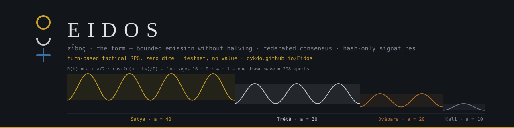

[](https://oykdo.github.io/Eidos/)

# Eidos

**English** · [Français](README.fr.md)

[](https://github.com/Oykdo/Eidos/actions/workflows/tests.yml)
[](https://github.com/Oykdo/Eidos/actions/workflows/chaine.yml)
[](https://oykdo.github.io/Eidos/)

A prototype chain with **bounded emission and no halving**, a **federated consensus**, and **post-quantum signatures made of hashing alone** — no elliptic curve anywhere. The specification is Python, standard library only. A web atelier replays the same rules in the browser. Testnet only: the eidôlon has no value.

- Live atelier: [oykdo.github.io/Eidos](https://oykdo.github.io/Eidos/)
- Testnet: seven validators, one block per hour forged by GitHub Actions, faucet and transfers through issues
- One file for your vault: `eidos.carnet`

## Contents

1. [The unit and the form](#1-the-unit-and-the-form)
2. [Five claims](#2-five-claims)
3. [Emission](#3-emission)
4. [Glyphs](#4-glyphs)
5. [Signatures](#5-signatures)
6. [Federated consensus](#6-federated-consensus)
7. [The testnet](#7-the-testnet)
8. [Relics and age seals](#8-relics-and-age-seals)
9. [The atelier](#9-the-atelier)
10. [Repository layout](#10-repository-layout)
11. [Verify everything](#11-verify-everything)
12. [What this repository is not](#12-what-this-repository-is-not)
13. [Licence](#13-licence)

## 1. The unit and the form

The unit of account is the **eidôlon** — εἴδωλον, the image — set against *eidos*, εἶδος, the form. The form is the rule; the image is what circulates. 1 eidôlon = 10⁸ atoms.

## 2. Five claims

1. **The reward never halves.** It oscillates on a bounded cosine, and an epoch sums exactly to the atom.
2. **The week is not a convention.** 24 = 3 × 7 + 3; that remainder of three orders the days, and here it rotates the proposers.
3. **An address is readable.** Three stacked figures, six bits per glyph, a checksum the eye can verify.
4. **Energy is bounded by consensus, not by the reward.** Proof of work never caps energy; a federation does.
5. **Nothing is trusted, everything is replayed.** The UTXO ledger is never written to disk: it is rebuilt by full replay every time the chain is opened, by the same code that forged it.

## 3. Emission

```
R(h) = a + b·cos( 2π(h − h₀) / T )     with b = a/2
```

The cosine sums to zero over a full period, so an epoch emits **exactly** `a·T`, distributed to the atom by largest remainder.

| Parameter | Value | Origin |
|---|---|---|
| Block interval (spec) | 600 s | — |
| `T` — blocks per epoch | **1008** | 168 hours × 6 blocks = one week |
| `h₀` — peak | **492** | 41/84 of the epoch, an exact integer |
| Bounds | `[a/2, 3a/2]` | max/min ratio = 3 |

### The four ages

| Age | `a` | Epochs | Blocks | Emission | Seal stake (atelier) |
|---|---|---|---|---|---|
| Satya | 40 | 832 | 838 656 | 33 546 240 | 33.55 eidôla |
| Trétâ | 30 | 624 | 628 992 | 18 869 760 | 18.87 |
| Dvâpara | 20 | 416 | 419 328 | 8 386 560 | 8.39 |
| Kali | 10 | 208 | 209 664 | 2 096 640 | 2.10 |

**Total emission: 62 899 200** eidôla over 2 096 640 blocks, i.e. 2 080 weeks ≈ 39.9 years. Ratio 16 : 9 : 4 : 1. Seal stake = age emission / 1 000 000.

`math.cos` depends on the local libm: two nodes could disagree. Eidos computes the cosine in `decimal.Decimal` by Taylor series, with π to 68 decimals. The tables are frozen in `genesis.json`. **Any change to `eonis.py`, even a comment, invalidates genesis** — the CI checks its fingerprint.

```
genesis.json  06b47645abedb5e0ac7d2fc7a1dd6fcd386ef493874fd2774544565ac46dbe28
eonis.py      cc94ad1e6eadf7027414a1347e870a4842689431b8fca2c1b381f93f4f1dfabc
block 0       00003d32ffa7a1dc7f1ace8ec08d0c739126ad4449fe004ea772710baec2c7b6
```

The banner above is drawn from this formula by `docs/banniere.py`, with the same Decimal cosine.

## 4. Glyphs

Three storeys, four states: empty `00`, circle `01`, crescent `10`, cross `11`. A glyph carries **6 bits**, read top to bottom.

| Use | Bits | Glyphs |
|---|---|---|
| Address | 160 | 27 |
| Checksum | 24 | 4 |
| Full digest | 256 | 43 |

The two padding bits of the 27th glyph must be zero, otherwise the address is refused. **Forbidden**: deriving a key or a seed from this alphabet.

## 5. Signatures

Everything rests on SHA-256, **with no elliptic curve**. Quantum resistance is structural, not bolted on.

- **WOTS+ for spends** (`wots.py`, RFC 8391: w = 16, 67 SHA-256 chains, every link tweaked by the public seed and a hash address, L-tree). The verifier rebuilds the public key from the signature: a witness of **2 176 bytes** (public seed 32 + signature 2 144), against 24 576 with Lamport. Address = SHA-256(public seed ‖ L-tree root)[:20]. **A key signs once**: an address can be spent only once in the whole chain, and spent addresses are remembered even across an assume-valid resume. The wallet emits a fresh address after every use.
- **XMSS for validators.** 2^k WOTS+ keys under a tweaked Merkle tree, public key = (root, public seed). Block signature: 4 + 2 144 + 32·k bytes. A stateful scheme: restoring an old backup means replaying published indices. The signer therefore keeps a **persistent counter** (`indice-<v>.json`, monotone, written under an exclusive lock and re-read from disk before every signature), and a node that already knows published indices refuses to restart from the chain alone unless told so explicitly.
- **UTXO root in the signed header.** Every block declares the Merkle root of the whole ledger after it (leaf = SHA-256d(txid ‖ rank ‖ address ‖ amount), order (txid, rank)); `id_bloc = SHA-256d(E.header ‖ root)`. A witness holding only the signed head (`etat.json.tete_signee`) recomputes `id_bloc`, checks the XMSS signature and judges an output proof without replaying. `noeud.py --depuis <h> <root>` resumes from an explicit checkpoint, never an implicit one.
- **Canonical serialisation.** A transaction must round-trip to the byte, or it is rejected.
- **Lamport** remains in the atelier as a demonstration (reuse, audit), outside consensus.

## 6. Federated consensus

`n` validators, one slot per block. Proposer of slot `s`: `V[(3·s) mod n]`. With `n = 7`: `[0, 3, 6, 2, 5, 1, 4]`. An `n` divisible by three is refused.

**Finality**: threshold `⌊2n/3⌋ + 1`, **independent of the rotation step**. Seven validators → five signatures.

**Liveness**: a slot `s > slot(now) + 1` is refused; without that bound, a single block dated too far ahead would freeze the chain. Skipping a slot (silence) stays legal, and holes are published (`creneaux_sautes`). At most six slots are caught up per run.

**Replay**: `Σ utxo == cumulative emission` after every block; the node refuses to publish if the invariant breaks. The coinbase is exactly `reward(h) + fees`.

Two consensus paths coexist in the repository: the **federated** one (`federation.py` + `noeud.py`, the real one) and a historical **proof-of-work** toy (`consensus.py` + `store.py`). They are never mixed.

## 7. The testnet

| | |
|---|---|
| Validators | 7, seeds derived from the public tag `eidos-testnet-3` |
| Signatures | XMSS of height 12: 4 096 per validator, about three years of hourly blocks |
| Slot | 3 600 s on the testnet (`federation.json`), 600 s in the spec |
| Forge | `chaine.yml`, hourly cron on GitHub Actions, on `main` only |
| Chain file | `chaine-eidos.dat`, format 3, written by the CI and never by hand |
| Published state | `etat.json`: balances, outputs, signed head, relics, invariant |

- **Faucet.** Open an issue containing an address in glyphs; `robinet.py` serves **one eidôlon per request**, one served request per GitHub account per epoch, one pending at a time, within an epoch budget of `a·T / 8`. The issue body is never interpolated into a command: it travels through an environment variable, and only what passes the glyph filter and the checksum is kept.
- **Transfers.** The atelier signs a spend and emits a text block between `-----EIDOS-----` markers (base64, 76-column lines); paste it in an issue. The node validates each transfer in a candidate block on a deep copy of the ledger, includes at most 8 per block, carries their fees into the coinbase, and expires requests older than one epoch.

Never write `chaine-eidos.dat`, `etat.json` or `mempool.json` from a workstation: those files belong to the `chaine` and `robinet` workflows.

## 8. Relics and age seals

A **relic** is a coin sealed on a WOTS+ address whose seed is printed in a QR code hidden somewhere in the world. Recovering it means spending it to your vault (Relics page → "Relic found", then a transfer issue). Since a key signs once, a relic can be recovered **once, by construction**: no server, no registry, the chain is the record. The keeper seals it with `python3 relique.py --sceller --age Kali --indice "…"` (QR as SVG, printable sheet, entry in `reliques.json`), and the seed exists **only in the QR**. The node publishes each declared relic's status in `etat.json` (`attente` / `intacte` / `recuperee`): a reading, not a proof. `python3 relique.py --animer <txid>` draws the relic in figures · ○ ☽ ✚ on the ellipse of its age.

A relic recovered into a vault becomes an **age seal**. The Tower is cut in four quarters (floors 0–63, 64–127, 128–191, 192–254); the doors at 64, 128 and 192 open only to the seal of the right age. The expected stake of a seal is its age's emission / 10⁶ — Kali 2.10 … Satya 33.55.

Details: [`docs/HANDOVER_RELIQUES_QR.md`](docs/HANDOVER_RELIQUES_QR.md).

## 9. The atelier

`atelier/` is the web interface (TanStack Start, React, three.js), 18 runtime dependencies. It replays the specification in TypeScript (`atelier/src/lib/eidos/`), and `vecteurs.json` — written by `vecteurs.py`, read by both sides — keeps Python and TypeScript identical to the byte (CI job `parite`).

| Register | Page | Role |
|---|---|---|
| Verify | **Vault** | Balance, send, save `eidos.carnet` |
| | **Log** | Genesis, chain, Merkle proof |
| | **Witness** | A second memory: the signed head, not the keys. Judges a published output |
| | **Glyphs** | 64 stacks, padding refused |
| Read | **Map** | Relics of the world by age and by muse; trophy of a seal, judged without replay |
| | **Signs** | Readings of the same 64 glyphs |
| Play | **Tower** | 255 floors, nine muses as hosts, elixirs, capsules and bestiary, secrets, doors by seal |
| | **Relics** | The relic scene and "Relic found" |
| | **Guide** | Verify / Read / Play, the five words, the limits |

**The Tower and the pendulum.** Exploration is free; at the end of each room the pendulum reads what the vault did there (honoured the host, opened an alcove, captured an occupant, or nothing) and chooses the **route** — 27 stops across nine bands — and the arrival cell, never the content of a floor, which stays public and fixed. A free run is a reading and counts for nothing. A run that counts is **anchored**: its seed is `SHA-256d("eidos-ascension/1" ‖ id_bloc ‖ txid ‖ rank)` — a signed head and a proven, unspent coin, never the vault, the machine or the browser. The finished ascension is exported and judged without replay. No browser fingerprint, no machine lock, no client proof of work: what counts is anchored, what is free is worth nothing ([`docs/SPEC_SYBIL.md`](docs/SPEC_SYBIL.md)).

**Figures are not proofs.** The map, the signs, the relic scene and the artefacts are readings; only the ledger, the chain and the signatures commit.

**One file.** The vault is written to `eidos.carnet`. WOTS+ signs a spend, not the file — signing a backup would burn a one-time key; the file carries a SHA-256d trace bound to the current address. A legacy `.psnx` still opens, then rewrites as `.carnet`.

Details: [`atelier/README.md`](atelier/README.md).

## 10. Repository layout

| File | Lines | Role | Checks |
|---|---|---|---|
| `eonis.py` | 267 | emission (Decimal cosine), glyph codec — **frozen** | 6 |
| `genesis.json` | 105 | frozen tables and fingerprints — **frozen** | — |
| `verify_genesis.py` | 134 | independent verification of genesis | 32 |
| `wots.py` | 284 | WOTS+ w = 16, L-tree, addresses, fingerprints | 5 |
| `utxo.py` | 509 | witnesses, addresses, transactions, ledger, UTXO root, validation | 15 |
| `federation.py` | 694 | XMSS, rotation, liveness, signed head, locked persistent counter | 18 |
| `noeud.py` | 1084 | testnet node: replay, forge, faucet, transfers, `--depuis`, relics, `etat.json` | 5 + 4 + 5 + 2 |
| `robinet.py` | 356 | faucet queue fed by issues, per-author brake | 11 |
| `vecteurs.py` | 171 | shared vectors Python ↔ TS (`vecteurs.json`, 8 families) | parity |
| `qr.py` | 428 | QR encoder, standard library, level H, versions 1–10 | 5 |
| `relique.py` | 236 | relic keeper: seal, animate | 3 |
| `consensus.py` | 204 | PoW difficulty and cumulative work — historical | 6 |
| `store.py` | 278 | PoW chain on disk — historical | — |
| `federation.json` | — | roots and public seeds of the 7 validators, t0, slot | — |
| `reliques.json` | — | declared relics: id, address, age, hint — never a seed | — |
| `chaine-eidos.dat` | — | the testnet chain, written by the CI | — |
| `etat.json`, `mempool.json` | — | published state; faucet and transfer requests | — |
| `docs/` | — | specifications: relics, tower, pendulum, Sybil, vault audit; banner generator | 2 |
| `atelier/` | — | web atelier; `npm test` runs 30 script tests and 286 Eidos tests | 286 |

CI (`.github/workflows/`): `tests.yml` (3 OS × 2 Python, fingerprints, hygiene, `parite`), `chaine.yml` (hourly forge), `robinet.yml` (issues), `pages.yml` (atelier), `init.yml`. Python 3.9 is the floor.

## 11. Verify everything

```bash
python3 verify_genesis.py      # 32 checks — always first
python3 eonis.py               # 6
python3 wots.py                # 5
python3 utxo.py                # 15
python3 vecteurs.py            # Python ↔ TS parity
python3 robinet.py --test      # 11
python3 -c "import noeud as N; N._test_artefact()"
python3 -c "import noeud as N; N._test_envois()"      # 5
python3 -c "import noeud as N; N._test_depuis()"      # 4
python3 -c "import noeud as N; N._test_indice()"      # 2
python3 -c "import noeud as N; N._test_reliques()"    # 5
python3 qr.py --test           # 5
python3 relique.py --test      # 3
python3 federation.py          # 18
python3 consensus.py           # 6, historical
python3 noeud.py --verifier    # full replay of the testnet: must end with « aucun refus »
python3 docs/banniere.py       # redraws the banners, 2 checks
cd atelier && npm ci && npm test && npm run dev
```

Tests are plain `assert` and `print`, no framework. Every validation rule comes with a check that violates it.

## 12. What this repository is not

- **No peer network.** No peers, no real fork resolution: the testnet is one node on a cron.
- **No hardened key store.** The seed is plaintext in the file.
- **No external audit.** WOTS+, XMSS and the Merkle tree are in-house implementations written from RFC 8391, without official vectors.
- **A federation is not trustless.** `n` known signers can collude. Governance is the open question, not cryptography.
- **Regulatory frame.** Prototyping is free; issuing and distributing a public token is not (MiCA in the EU). The eidôlon has no value.

## 13. Licence

[Apache License 2.0](LICENSE). Copyright 2026 Jeremy Zgonec.
